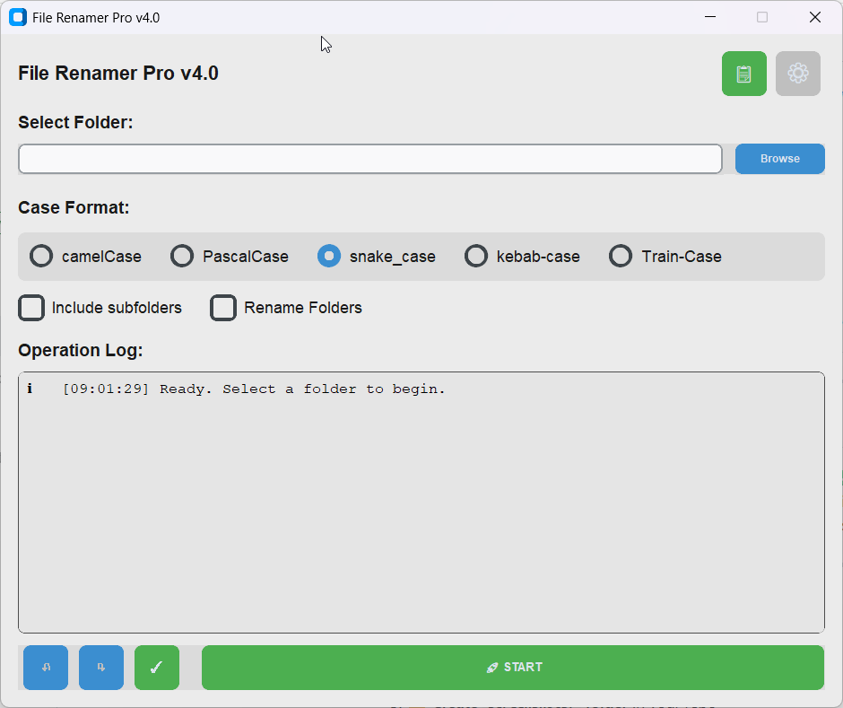
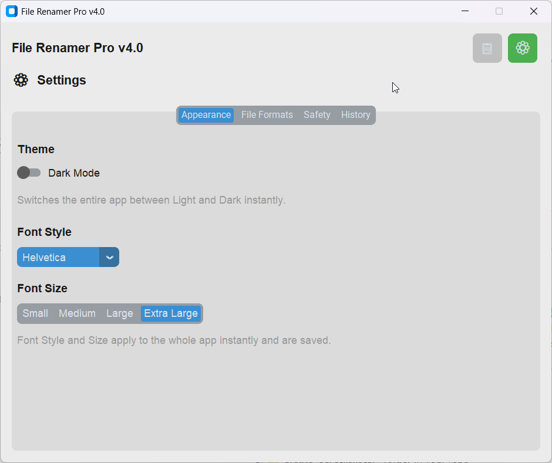
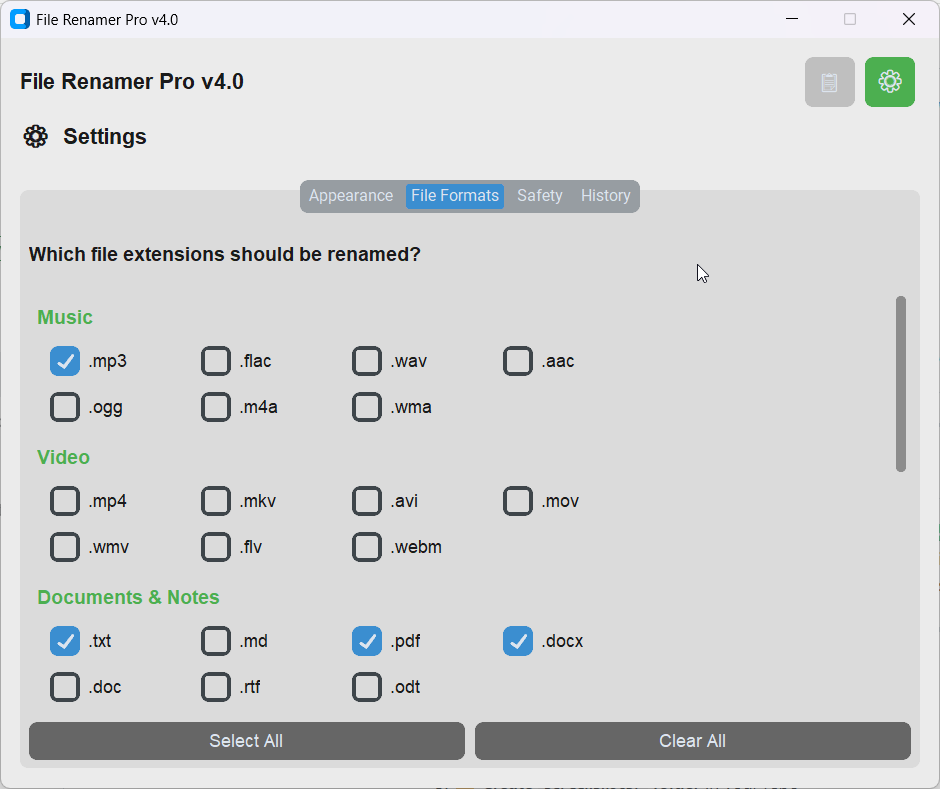

# File Rename Pro — Batch File Renaming Software for Windows

**File Rename Pro** is a clean, fast batch-renaming tool for files and folders with intelligent case conversion. Rename hundreds of files in seconds with preview-before-apply safety. Perfect for organizing photos, code files, documents, and more.

> 🎯 **Searching for:** file rename, batch file renaming, file renamer tool, folder renaming software, case converter, bulk rename files, Windows file rename tool?
> 
> **File Rename Pro** is your answer. No command line. No confusion. Just point, pick a naming style, and go.

---

## 🎨 **Screenshots**

### S1: Main Window — Clean & Intuitive Interface
Select your folder, pick a case format, and preview all changes before applying.



**Features shown:**
- 📂 Folder selection with Browse button
- 🔤 Case format options (camelCase, PascalCase, snake_case, kebab-case)
- ☐ Include subfolders & Rename Folders toggles
- 📝 Operation log showing ready state
- 🚀 START button & Undo/Redo controls

---

### S2: Settings - Appearance Tab
Customize theme, fonts, and appearance — all changes apply instantly.



**Customization options:**
- 🌓 Dark Mode toggle
- 🔤 Font Style dropdown (Helvetica, Arial, Verdana, etc.)
- 📏 Font Size selector (Small, Medium, Large, Extra Large)
- ⚡ Changes apply instantly without restart

---

### S3: Settings - File Formats Tab
Choose which file types to rename with organized categories.



**Organized by category:**
- 🎵 Music (.mp3, .flac, .wav, .aac, .ogg, .m4a, .wma)
- 🎬 Video (.mp4, .mkv, .avi, .mov, .wmv, .flv, .webm)
- 📄 Documents & Notes (.txt, .md, .pdf, .docx, .doc, .rtf, .odt)
- 🖼️ Images (.jpg, .jpeg, .png, .gif, .bmp, .svg, .webp)
- 📊 Spreadsheets & Data (.xlsx, .xls, .csv, .json, .xml)
- 📦 Archives (.zip, .rar, .7z, .tar, .gz)
- 🔧 Other (.html, .css, .js, .py, .log, .epub)
- ✅ Quick Select All / Clear All buttons

---

## What It Does

Renaming a hundred files by hand is the kind of small misery nobody should have to live through. **File Rename Pro** does it for you — cleanly, safely, and in seconds.

Point it at a folder, pick a naming style, and watch it convert everything into tidy `camelCase`, `PascalCase`, `snake_case`, or `kebab-case`. You see every change *before* it happens, and you can undo it instantly if needed.

### Key Features

- **📝 Intelligent Case Conversion** — Converts between camelCase, PascalCase, snake_case, and kebab-case. Understands word boundaries and acronyms (`HTMLParser` → `html_parser`, not `h_t_m_l_parser`).
- **👀 Preview Everything** — See all renames before they happen. Apply or undo with one click.
- **🛡️ Safety First** — System files (.exe, .dll, .sys) and protected Windows folders are automatically skipped.
- **📁 Files & Folders** — Rename individual files, entire folder trees, or both. Nested paths stay intact.
- **⚙️ Full Control** — Choose file types, go recursive or not, switch themes, adjust text size. Settings are remembered.
- **⏮️ Undo/Redo** — Changed your mind? Undo and redo as many times as you want before closing.

---

## Why Choose File Rename Pro?

- **🚀 Fast** — Process hundreds of files in seconds
- **💻 Windows-Optimized** — Built for Windows batch file operations
- **🎨 Modern UI** — Clean, intuitive interface powered by CustomTkinter
- **🔒 Safe** — No data loss. Preview before applying. Undo anytime.
- **📦 Portable** — Single .exe file, no installation needed
- **🆓 Free & Open Source** — MIT license. Personal and commercial use allowed.
- **💪 No Dependencies** — Minimal footprint, blazing fast

---

## Installation & Setup

### Windows — Quick Start (Easiest)

1. **Download** the repository or clone it:
   ```bash
   git clone https://github.com/JoshuvaIn/File_Rename_Pro.git
   cd File_Rename_Pro
   ```

2. **Build the portable .exe:**
   ```bash
   build_portable.bat
   ```

3. **Run the app:**
   - Find `FileRenamerPro_Portable.exe` in the `dist/` folder
   - Double-click to launch

> ⚠️ **Windows SmartScreen Warning?** Click **"More info" → "Run anyway."** This warning appears because the app isn't code-signed — it's completely safe and normal for free tools.

### Linux / macOS (From Source)

```bash
git clone https://github.com/JoshuvaIn/File_Rename_Pro.git
cd File_Rename_Pro
python -m venv venv
source venv/bin/activate  # On Windows: venv\Scripts\activate
pip install -r requirements.txt
python app.py
```

**Requires:** Python 3.8 or higher

---

## How to Use File Rename Pro

1. **📂 Select Folder** — Browse and choose the folder with files you want to rename
2. **🔤 Choose Case Style** — Pick `camelCase`, `PascalCase`, `snake_case`, or `kebab-case`
3. **⚙️ Configure Options** — Optionally enable:
   - Include subfolders (recursive rename)
   - Rename folders (not just files)
   - Custom file type filters
4. **👁️ Preview** — Click **START** to see all proposed changes
5. **✅ Apply or Undo** — Click **✓** to apply, or **↶ / ↷** to undo and redo

### Settings Panel

Access **⚙️ Settings** to:
- Change theme (light/dark)
- Filter by file type
- Toggle safety protection
- Enable rename logging

---

## Common Use Cases

- **Photo Organization** — Convert `IMG_2025_01_15_123456.jpg` to `photo_01_15_2025.jpg`
- **Code Files** — Rename variables and files to follow coding standards (snake_case, camelCase)
- **Document Management** — Bulk rename documents with consistent naming conventions
- **Folder Structure** — Rename nested folders to follow organizational standards
- **Download Cleanup** — Organize messy download folders with consistent naming

---

## Technical Details

**Built with:**
- Python 3.8+
- [CustomTkinter](https://github.com/TomSchimansky/CustomTkinter) — Modern GUI framework
- Single, readable `app.py` file — Easy to modify and understand

**File Size:** ~43 KB

**Operating System:** Windows (Linux/macOS also supported when running from source)

---

## Troubleshooting

**Q: Windows says "protected your PC" when I try to run the .exe**
- A: Click "More info" → "Run anyway." The app isn't code-signed, which is normal for free community tools.

**Q: How do I build from source?**
- A: Run `build_portable.bat` in the root directory. The finished .exe appears in `dist/`.

**Q: Can I rename system files?**
- A: No, by design. System files (.exe, .dll, .sys) and Windows protected folders are skipped automatically for your safety.

**Q: Does it work on Mac/Linux?**
- A: Yes! Install from source using the Linux/macOS instructions above.

---

## Contributing

Found a bug? Have a feature idea? Want to improve the code?

- **Report bugs** via [GitHub Issues](https://github.com/JoshuvaIn/File_Rename_Pro/issues)
- **Suggest features** in [Discussions](https://github.com/JoshuvaIn/File_Rename_Pro/discussions)
- **Submit pull requests** for improvements

See [CONTRIBUTING.md](CONTRIBUTING.md) for details.

---

## License

[MIT License](LICENSE) — Free for personal and commercial use.

---

## Topics & Keywords

`file-rename` `batch-rename` `file-renamer` `folder-renaming` `case-conversion` `Windows-software` `file-management` `bulk-rename` `rename-tool` `file-organization`

---

**Get started:** [Clone the repo](https://github.com/JoshuvaIn/File_Rename_Pro) or [Download the latest release](https://github.com/JoshuvaIn/File_Rename_Pro/releases)

⭐ **If you find this useful, please star the repository!** ⭐
